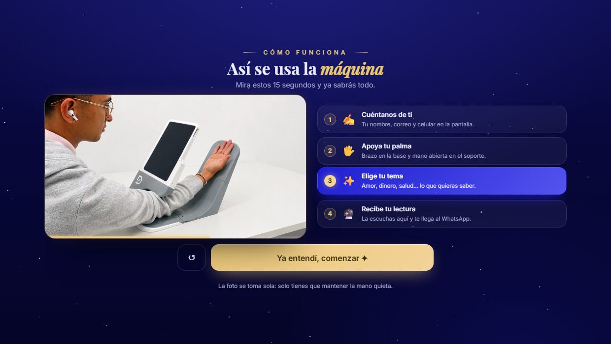
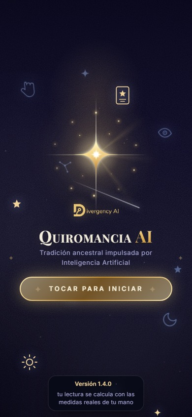
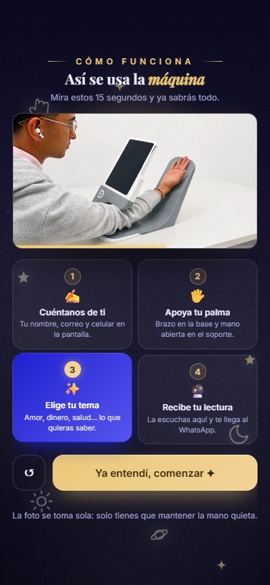
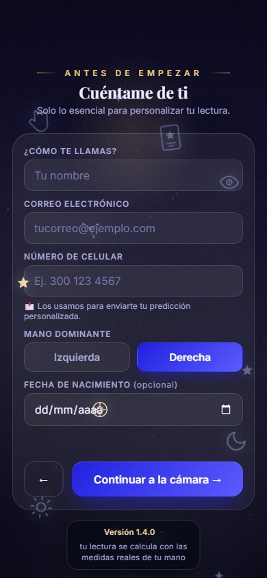
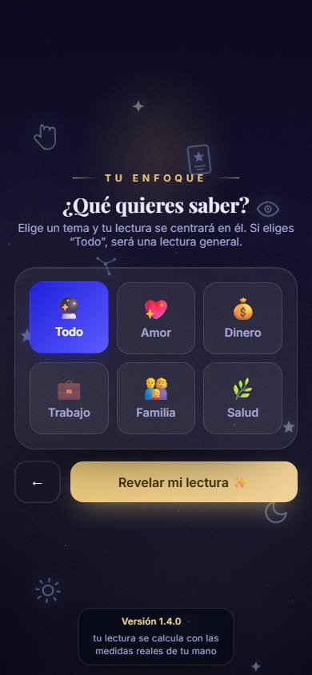
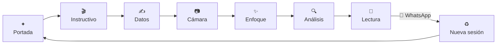

<div align="center">


# ✦ Quiromancia AI ✦

### Tradición ancestral impulsada por Inteligencia Artificial

**Una máquina que lee la palma de tu mano.**
La persona apoya el brazo, abre la mano, y en menos de un minuto
escucha su lectura y la recibe en su WhatsApp.

<br>


<br>



<sub>Desarrollada por la casa de software <b>Divergency IA</b></sub>

</div>

---

> ### 🟢 Versión estable
>
> **`1.4.0` es la versión estable actual del proyecto.** Está en `main`, replicada en la
> rama `despliegue` y etiquetada como **`v1.4.0`** en el repositorio.
> Es la versión recomendada para llevar la máquina a un evento.
>
> El detalle de lo que trae cada versión está en **[CHANGELOG.md](CHANGELOG.md)**.

---

## 🔮 Qué hace

Quiromancia AI convierte la lectura de manos en una experiencia de kiosco: la persona se
acerca sola, la máquina la guía, y nadie tiene que estar explicando el proceso.

<table>
<tr>
<td width="50%" valign="top">

**Para quien se sienta**

- 🎬 Un **video de 15 s** le muestra cómo usar la máquina
- ✍️ Deja sus datos en cuatro campos
- 🖐️ Apoya la palma — **la foto se toma sola**
- ✨ Elige qué quiere saber
- 🔊 **Escucha** su lectura con voz de oráculo
- 📲 La recibe completa **por WhatsApp**

</td>
<td width="50%" valign="top">

**Para quien opera el evento**

- ♻️ La sesión **se cierra sola** y queda lista para el siguiente
- 🧹 Los datos del anterior **se borran** al reiniciar
- 🙅 No hace falta explicar nada en cada turno
- 🔒 Límite de **3 lecturas por correo**
- 📐 La lectura usa las **medidas reales** de esa mano
- 📱 Funciona en kiosco vertical, tablet o móvil

</td>
</tr>
</table>

---

## 📸 Así se ve

<div align="center">

| Portada | Instructivo | Datos | Enfoque |
|:---:|:---:|:---:|:---:|
|  |  |  |  |

</div>

---

## 🧭 El recorrido



La **cámara detecta la mano en vivo** con MediaPipe y dispara sola cuando la palma está
bien encuadrada; si lo que ve no es una mano, lo avisa y pide repetir la foto en vez de
inventarse una lectura.

---

## ✨ Funcionalidades

| | |
|---|---|
| 🎬 **Instructivo en video** | Pantalla propia al iniciar, con el video de la máquina y 4 pasos que se encienden a su ritmo. Repetible desde la portada. |
| 🖐️ **Disparo automático** | MediaPipe `HandLandmarker` detecta la palma en vivo, cuenta atrás y toma la foto sola. |
| 🚫 **"Eso no es una mano"** | Si la foto no es una palma, avisa y pide repetirla. |
| 📐 **Medidas reales** | Proporción de la palma, dedo medio, índice/anular, ángulo del pulgar y separación de dedos alimentan la lectura. |
| 🔍 **Análisis con IA** | OpenAI con visión sobre la foto de la palma. |
| 🗺️ **Croquis interactivo** | La mano dibujada con sus líneas; al tocar una tarjeta se resalta su línea. |
| 🔊 **Voz del oráculo** | ElevenLabs, con la voz del navegador como respaldo. |
| 🎵 **Ambiente** | Audio en la intro y música suave durante la lectura. |
| ✨ **Enfoque** | Todo, Amor, Dinero, Trabajo, Familia o Salud. |
| ♈ **Signo automático** | Se calcula solo a partir de la fecha de nacimiento. |
| 📲 **Entrega por WhatsApp** | La lectura completa le llega al celular. |
| ♻️ **Modo kiosco** | Cierre automático con cuenta regresiva y borrado de los datos anteriores. |
| 📱 **Responsive de verdad** | Verificado en 12 tamaños, de kiosco 1080×1920 a móvil de 320 px. |

---

## 🛠️ Con qué está hecho

<div align="center">


</div>

Sin framework ni compilación: el frontend es **un solo `public/index.html`**. Se abre, se
edita y se despliega — nada de `npm run build`.

---

## 🚀 Probarlo en local

```bash
node dev-server.mjs      # → http://localhost:3000
```

Las claves se leen de `.env` (parte de `.env.example`). En local, los *leads* y las
predicciones se guardan en archivos `*.local.json` y **no se envía correo real**.

---

## 🗂️ Estructura

```
quiromancia/
├─ public/                       # Firebase Hosting (frontend)
│  ├─ index.html                 # ← toda la app: pantallas, estilos y lógica
│  ├─ img/    (logo, estrella, icono.svg)
│  ├─ mp3/    (intro + música de fondo)
│  └─ video/  tutorial-maquina.mp4   ← el instructivo
├─ functions/                    # Cloud Functions (backend)
│  ├─ index.js                   # API: /lectura /voz /lead /enviar
│  ├─ handlers.js                # OpenAI, ElevenLabs, medidas y leads
│  └─ quiromancia.txt            # guía de quiromancia que alimenta la lectura
├─ docs/                         # material de origen y capturas
├─ dev-server.mjs                # servidor local (replica la estructura de Firebase)
├─ firebase.json                 # hosting + rewrites + functions + firestore
├─ CHANGELOG.md                  # qué cambió en cada versión
└─ LEEME.md                      # guía detallada, paso a paso
```

---

## 🔐 Lo que no está en el repo

Por seguridad, estos valores **no se versionan** y se configuran al desplegar:

| Qué | Dónde |
|---|---|
| Clave de OpenAI y de ElevenLabs | *Secrets* de Cloud Functions |
| Config web de Firebase | `public/index.html` |
| ID del proyecto | `.firebaserc` |

---

## ☁️ Desplegar

> Requiere plan **Blaze**: las Functions llaman a servicios externos.

```bash
npm i -g firebase-tools && firebase login

# PROJECT-ID en .firebaserc · Firestore y Authentication activados en consola
firebase functions:secrets:set OPENAI_API_KEY
firebase functions:secrets:set ELEVENLABS_API_KEY

cd functions && npm install && cd ..
firebase deploy
```

El paso a paso completo, con las notas de correo y dominios autorizados, está en
**[LEEME.md](LEEME.md)** y **[MANUAL-DESPLIEGUE.md](MANUAL-DESPLIEGUE.md)**.

---

## 🗄️ Datos que se guardan

| Colección | Contenido |
|---|---|
| `leads` | Datos del formulario |
| `predicciones_enviadas` | Lecturas solicitadas por la persona |

El acceso es **solo desde Cloud Functions** (ver `firestore.rules`).

---

## 🌿 Ramas

| Rama | Para qué |
|---|---|
| `main` | Desarrollo. Aquí vive la versión estable. |
| `despliegue` | Lo que va a producción: misma app + credenciales y ajustes del despliegue. |

Lo que se termina en `main` se mergea a `despliegue` cuando toca desplegar.

---

<div align="center">


**Quiromancia AI** · versión estable `1.4.0`

Hecho por **Divergency IA**

</div>
